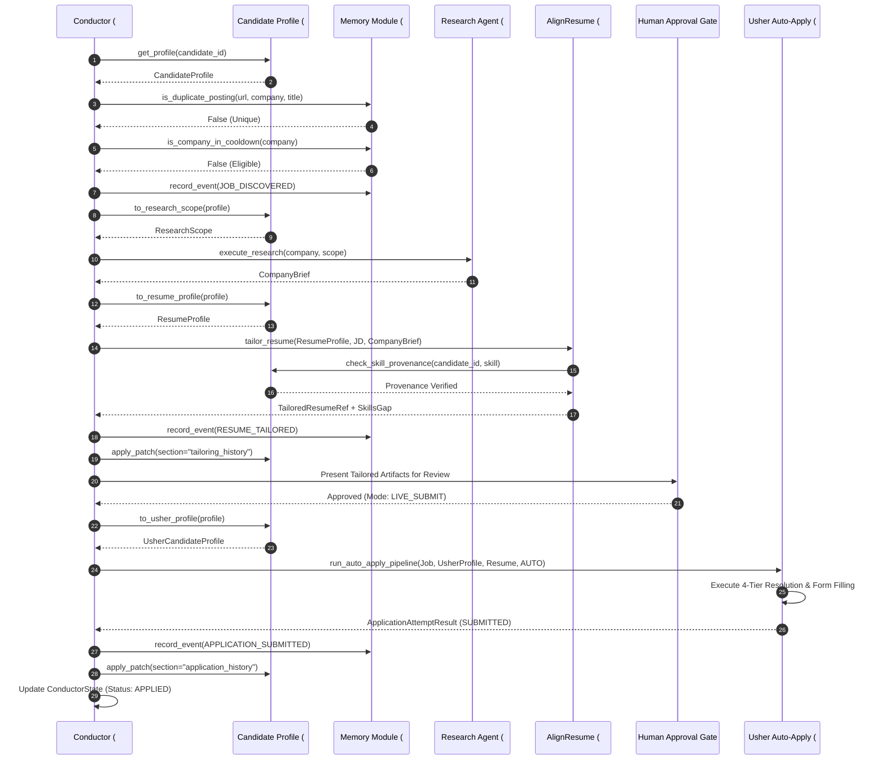

# Comprehensive Reference Report: Integration of Conductor Orchestrator (#6) with Memory Module (#8), Usher Auto-Apply (#7), and Candidate Profile (#10)

**Document ID:** CND-INT-REF-v1.0  
**Target Systems:** AI-Native Job Agent Architecture  
**Author:** Soumyadeep Nath ([@sdn9300](https://github.com/sdn9300))  
**Classification:** Canonical Architecture & Integration Reference  

---

## Executive Summary

The **AI-Native Job Agent Architecture** is a decentralized, multi-agent ecosystem engineered to automate end-to-end career workflows—from job discovery and market intelligence to bespoke resume alignment, direct cold outreach, and headless ATS portal form submission.

At the core of this system are four foundational subsystems:
1. **Conductor Orchestrator (`#6`)**: The LangGraph-powered coordination layer managing workflow routing, state progression, human-in-the-loop approvals, and failure containment.
2. **Candidate Profile (`#10`)**: The canonical, validated, version-controlled single source of truth for candidate data, employing projection patterns and ownership-partitioned mutation models.
3. **Memory Module (`#8`)**: The durable, event-sourced audit ledger and interaction memory maintaining immutable lifecycle records, domain cooldown suppression, and state replayability.
4. **Usher / PDF Auto-Apply (`#7`)**: The policy-gated action agent featuring a 4-tier field resolution engine, multi-ATS DOM adapters, and Playwright-driven headless application submission.

This document provides an exhaustive, code-level architectural analysis of how these four independent subsystems integrate into a unified, reliable, and observable autonomous agentic pipeline. It captures the design decisions, interface contracts, state machines, edge case mitigations, and cross-cutting architectural principles to serve as a definitive benchmark for future agentic engineering projects.

---

## System Topology & Ecosystem Context

```text
+----------------------------------------------------------------------------------------------------+
|                                      DATA & IDENTITY LAYER                                         |
|                                                                                                    |
|                       +----------------------------------------------------+                       |
|                       |            Candidate Profile (Node #10)            |                       |
|                       |  - Canonical Identity, Experience, Skills          |                       |
|                       |  - Projections: Resume, Gleaner, Usher, Outreach   |                       |
|                       |  - Ownership-Based Patch Merging                   |                       |
|                       |  - Skill Provenance Anti-Fabrication Hook          |                       |
|                       +----------------------------------------------------+                       |
+--------------------------------------------------+-------------------------------------------------+
                                                   | Projected Views & Patches
                                                   v
+----------------------------------------------------------------------------------------------------+
|                                    COORDINATION & ROUTING LAYER                                    |
|                                                                                                    |
|                       +----------------------------------------------------+                       |
|                       |             Conductor Agent (Node #6)              |                       |
|                       |  - LangGraph State Machine (ConductorState)        |                       |
|                       |  - Dynamic Channel Routing (Email vs Portal)       |                       |
|                       |  - Human-in-the-Loop Approval Gate (ADR-6)         |                       |
|                       |  - Pluggable Adapter & Storage Layer (ADR-2)       |                       |
|                       +------------------+--------------+------------------+                       |
+------------------------------------------|--------------|------------------------------------------+
                                           |              |
                      Invocation & Payload |              | Application Receipts & Events
                                           v              v
+------------------------------------------+----+   +-----+------------------------------------------+
|               ACTION LAYER                    |   |          PERSISTENCE & AUDIT LAYER             |
|                                               |   |                                                |
|  +-----------------------------------------+  |   |  +------------------------------------------+  |
|  |     Usher / PDF Auto-Apply (Node #7)    |  |   |  |        Memory Module (Node #8)           |  |
|  |  - 4-Tier Field Resolution Engine       |  |   |  |  - Append-Only Event Ledger (SQLite)     |  |
|  |  - Multi-ATS Adapters (Greenhouse, etc) |  |   |  |  - Replayable Derived State Materializer |  |
|  |  - Headless Browser Application Run     |  |   |  |  - Deterministic Idempotency (ADR-5)     |  |
|  |  - PDF Compilation & Verification       |  |   |  |  - Domain Cooldown & Dedup Engine        |  |
|  +-----------------------------------------+  |   |  +------------------------------------------+  |
+-----------------------------------------------+   +------------------------------------------------+
```

---

## 1. Deep Component Architectures

### 1.1 Conductor Orchestrator (#6)
- **Role:** Central workflow conductor. Orchestrates job processing from discovery to submission.
- **State Engine:** LangGraph explicit state machine carrying `ConductorState` (Pydantic v2 model).
- **Core Nodes:**
  - `discover_node`: Ingests opportunities from Gleaner, performs pre-flight deduplication and domain cooldown suppression.
  - `research_node`: Calls Research Agent (`#4`) to construct a grounded `CompanyBrief`.
  - `align_resume_node`: Invokes AlignResume (`#2`) for resume tailoring with strict skill provenance validation.
  - `human_gate_node`: Pauses execution for candidate review/approval of artifacts (ADR-6).
  - `route_channel_node`: Evaluates target properties to route between direct cold outreach (`Overture #3`) and web portal application (`Usher #7`).
  - `auto_apply_node`: Dispatches form filling to Usher.
  - `outreach_node`: Dispatches cold email drafts to Overture.
  - `checkpoint_node`: Records terminal status into the event ledger and execution checkpoint store.

### 1.2 Candidate Profile (#10)
- **Role:** Canonical shared state representing the candidate's career history, preferences, and verified competencies.
- **Key Architectural Properties:**
  - **Single Source of Truth:** Replaces disparate text files with a strongly typed Pydantic v2 model (`CandidateProfile`).
  - **Consumer Projections:** Rather than exposing the entire raw profile, it exposes dedicated projection functions (`to_resume_profile`, `to_gleaner_query`, `to_outreach_context`, `to_usher_profile`, `to_research_scope`) that map canonical data into component-specific input schemas.
  - **Ownership-Partitioned Mutability:** Nodes can only update sections they own (e.g., AlignResume owns `tailoring_history`; Usher owns `application_history`). Mutations occur via `CandidateProfilePatch` processed through a deterministic reducer `merge_candidate_profile`.
  - **Anti-Fabrication Guardrail:** Exposes `check_skill_provenance(candidate_id, skill_name)` which verifies that any skill claimed during tailoring maps to verified employment or project history.

### 1.3 Memory Module (#8)
- **Role:** Central event ledger and interaction memory tracking the end-to-end lifecycle of every application.
- **Key Architectural Properties:**
  - **Append-Only Event Sourcing (Law 8):** Every system action is recorded as an immutable `MemoryEvent`. The database table `memory_events` is the single source of truth.
  - **Derived State Materialization:** Tables like `applications`, `status_transitions`, and `domain_cooldowns` are projections computed from the event stream. They can be completely dropped and rebuilt via `rebuild_derived_state()`.
  - **Deterministic Idempotency (ADR-5):** Generates event IDs via:
    $$\text{event\_id} = \text{SHA256}(\text{source\_component} : \text{raw\_source\_ref} : \text{event\_type} : \text{occurred\_at})[:32]$$
    Duplicate event submissions are safely ignored without error.
  - **Cooldown Suppression:** Automatically establishes domain-level cooldown records on terminal rejection events to prevent candidate spamming.

### 1.4 Usher / PDF Auto-Apply (#7)
- **Role:** Autonomous portal form-filling and PDF submission engine.
- **Key Architectural Properties:**
  - **4-Tier Field Resolution Engine:**
    - *Tier 0 (Deterministic):* Direct dictionary lookup against `UsherCandidateProfile`.
    - *Tier 1 (Fuzzy/Synonym):* Heuristic matching for standardized fields.
    - *Tier 2 (LLM Light):* Contextual extraction for standard dropdowns and radio selections.
    - *Tier 3 (LLM Heavy / Free-Text):* Open-ended question answering (sets confidence to $0.0$ to require explicit review).
  - **Multi-ATS Adapters:** Specialized DOM interaction scripts for Greenhouse, Lever, Workday, Ashby, and Generic forms.
  - **Execution Seam:** Exposes `auto_apply_node(state)` for direct LangGraph integration and `run_auto_apply_pipeline()` for standalone execution.

---

## 2. End-to-End Integration Architecture

### 2.1 The Complete Execution Lifecycle



---

## 3. Code-Level Interface Contracts & Integration Seams

### 3.1 Conductor <-> Candidate Profile Contract

Conductor integrates with Candidate Profile through `conductor/adapters/candidate_profile.py`:

```python
from candidate_profile.models import CandidateProfile
from candidate_profile.storage import CandidateProfileStore
from candidate_profile.concurrency import CandidateProfilePatch, merge_candidate_profile
from candidate_profile.projections import (
    to_resume_profile,
    to_gleaner_query,
    to_outreach_context,
    to_usher_profile,
    to_research_scope,
)

class CandidateProfileAdapter:
    def __init__(self, data_dir: Optional[str] = None):
        self.store = CandidateProfileStore(base_dir=data_dir)

    def get_profile(self, candidate_id: str) -> Optional[CandidateProfile]:
        return self.store.get(candidate_id)

    def apply_patch(
        self,
        base_profile: CandidateProfile,
        section: str,
        patch_payload: Any,
        writer_component: str
    ) -> CandidateProfile:
        patch = CandidateProfilePatch(
            section=section,
            writer_component=writer_component,
            value=patch_payload,
        )
        updated_profile = merge_candidate_profile(base_profile, patch)
        self.store.put(updated_profile)
        return updated_profile
```

### 3.2 Conductor <-> Memory Module Bridge (`EventSourcedMemoryStore`)

Conductor preserves its abstract `MemoryStore` interface while delegating business domain tracking to the event ledger via `conductor/storage/event_sourced_store.py`:

```python
from conductor.storage.base import MemoryStore as ConductorMemoryStoreInterface
from src.store import MemoryStore as StandaloneEventLedger
from src.models import MemoryEvent, EventType, ApplicationStatus
from src.adapters import (
    from_harvester_event,
    from_align_resume_event,
    from_overture_event,
    from_auto_apply_receipt,
    from_classified_signal,
)

class EventSourcedMemoryStore(ConductorMemoryStoreInterface):
    def __init__(self, db_path: str):
        self._ledger = StandaloneEventLedger(db_path=db_path)

    def is_duplicate_posting(self, link: Optional[str], company: Optional[str], title: Optional[str]) -> bool:
        apps = self._ledger.list_applications()
        for app in apps:
            if app.company.lower() == (company or "").lower() and app.role_title.lower() == (title or "").lower():
                return True
        return False

    def is_company_in_cooldown(self, company: str, cooldown_days: int = 30) -> bool:
        result = self._ledger.check_domain_cooldown(domain=company.lower())
        return result.get("is_blocked", False)

    def save_application(self, record: ApplicationRecord) -> bool:
        if record.status == "discovered":
            event = from_harvester_event(record.model_dump())
        elif record.status == "tailored":
            event = from_align_resume_event(record.model_dump())
        elif record.status == "applied":
            event = from_auto_apply_receipt(record.model_dump())
        else:
            return True
        self._ledger.record_event(event)
        return True
```

### 3.3 Conductor <-> Usher Execution Bridge

Conductor translates canonical state and invokes Usher through `conductor/adapters/auto_apply.py`:

```python
from usher.conductor import run_auto_apply_pipeline
from usher.schemas import (
    ApplicationAttemptResult as UsherAttemptResult,
    JobApplicationTarget as UsherJobTarget,
    ResumeArtifact as UsherResumeArtifact,
    SubmissionMode,
)
from candidate_profile.projections import to_usher_profile

class PDFAutoApplyAdapter(AgentAdapter):
    def invoke(self, payload: Dict[str, Any]) -> AgentResult:
        # 1. Project CandidateProfile -> UsherCandidateProfile
        canonical_profile = payload.get("profile")
        usher_profile = to_usher_profile(canonical_profile)

        # 2. Build Job Target & Resume Artifact
        posting = payload["application"]["posting"]
        job_target = UsherJobTarget(
            job_id=payload.get("job_id"),
            company=posting["company"],
            title=posting["title"],
            apply_url=posting["url"],
            jd_text=posting["jd_text"]
        )
        resume_artifact = UsherResumeArtifact(
            resume_id="res_01",
            pdf_path=payload["tailored_resume"]["pdf_path"],
            text_content=payload["tailored_resume"]["tailored_content"]
        )

        # 3. Determine Execution Mode
        mode = SubmissionMode.AUTO if not self.dry_run else SubmissionMode.DRAFT

        # 4. Execute Pipeline
        attempt_result = run_auto_apply_pipeline(
            job=job_target,
            profile=usher_profile,
            resume=resume_artifact,
            mode=mode
        )

        return AgentResult(
            success=(attempt_result.status in ["SUBMITTED", "DRY_RUN_COMPLETED"]),
            output={"attempt_result": attempt_result.model_dump()},
            error=attempt_result.error_message
        )
```

---

## 4. Dual-Storage Architecture: Checkpointing vs. Event Ledgering

A critical architectural distinction maintained in this integration is the strict separation between **Execution Checkpointing** and **Business Domain Event Ledgering**:

| Attribute | Execution Checkpoint (`conductor_memory.db`) | Event Ledger (`memory.db`) |
|---|---|---|
| **Governing Law** | ADR-4 (Zero Silent Drops) | Law 8 (Memory Event Sourcing) |
| **Primary Consumer** | LangGraph State Machine | Analytics, Cooldowns, Memory Module, Downstream Agents |
| **Data Lifecycle** | Ephemeral per execution run / Graph state resume | Permanent, append-only, immutable audit trail |
| **Schema Model** | Serialized state dumps (`ConductorState`) | Strongly typed schema-on-read `MemoryEvent` stream |
| **Failure Recovery** | Resumes interrupted node execution mid-graph | Rebuilds application lifecycle history via event replay |
| **Coupling** | Infrastructure concern | Business domain concern |

> **Architectural Lesson:** Never collapse execution checkpointing into the business domain event ledger. Keeping them separate prevents workflow-engine lock-in and protects historical audit logs from state-machine migrations.

---

## 5. Failure Modes, Guardrails & Mitigations

### 5.1 Anti-Fabrication Guardrail (Skill Provenance Verification)
- **Failure Mode:** LLM tailoring inserts high-value skills into resume bullets that the candidate does not actually possess.
- **Mitigation:** AlignResume calls `check_skill_provenance(candidate_id, skill)` on Candidate Profile before emitting `TailoredResumeRef`. If provenance fails, the skill is stripped or replaced with verified experience.

### 5.2 Anti-Spam & Rate-Limiting Guardrail (Domain Cooldown)
- **Failure Mode:** Gleaner repeatedly ingests postings from a company that has recently rejected the candidate, causing aggressive, spammy outreach.
- **Mitigation:** Rejections ingested via Sentiment Classifier trigger a `DomainCooldown` record in Memory Module. Conductor's `discover_node` queries `is_company_in_cooldown()` and transitions the state immediately to `skipped_cooldown`.

### 5.3 Form Submission Safety (4-Tier Resolution Gating)
- **Failure Mode:** Automated browser enters erroneous or nonsensical answers into open-ended ATS essay questions.
- **Mitigation:** Usher's Tier 3 resolution assigns a confidence score of $0.0$ to all LLM-generated free-text answers. When Tier 3 fields exist, Usher flags the attempt, produces a draft session artifact, and alerts the user rather than auto-submitting.

### 5.4 Deduplication Guardrail (URL Hash & Title Match)
- **Failure Mode:** Duplicate job postings ingested from multiple job boards (Indeed, Wellfound, LinkedIn).
- **Mitigation:** Memory Module performs dual-key deduplication checking both raw URL hashes and normalized `(company_name, role_title)` tuples before initiating the LangGraph flow.

---

## 6. Comprehensive Architectural Decision Records (ADRs)

### ADR-INT-001: Projector Pattern for Sibling Component Inputs
- **Decision:** Use explicit functional projectors (`to_resume_profile`, `to_usher_profile`) located in `candidate_profile/projections.py` rather than having sibling components directly import the monolithic `CandidateProfile`.
- **Rationale:** Prevents tight schema coupling. If Usher changes its internal data models, only `to_usher_profile` requires an update; the canonical candidate profile and other agents remain untouched.

### ADR-INT-002: Adapter-Based Delegation for Event Sourcing
- **Decision:** Implement `EventSourcedMemoryStore` inside Conductor conforming to Conductor's existing `base.MemoryStore` abstract class, delegating to `memory_module.store.MemoryStore`.
- **Rationale:** Preserves Conductor's internal node call sites while seamlessly swapping local SQLite storage for a centralized, replayable event ledger.

### ADR-INT-003: Single Responsibility for Human Approval
- **Decision:** Enforce human approval exclusively in Conductor's upstream `human_gate_node` (ADR-6), passing pre-approved submission instructions down to Usher.
- **Rationale:** Prevents redundant confirmation prompts. Usher acts purely as an execution engine honoring the `SubmissionMode` dictated by Conductor.

---

## 7. Strategic Blueprint for Future Agentic Projects

When building next-generation autonomous multi-agent architectures, apply these verified principles:

1. **Decouple Data Schemas from Agent Logic with Projections:** Maintain one canonical identity schema and write deterministic projections for each specialized tool or subagent.
2. **Treat Events as the Single Source of Truth:** Use append-only event logs for all domain-level operations. Derived tables should always be disposable and replayable.
3. **Partition State Mutations by Agent Ownership:** Enforce section-level access control on shared state models so agents cannot overwrite data outside their bounded domain.
4. **Isolate Infrastructure Checkpoints from Business Ledgers:** Keep orchestrator state (e.g. LangGraph checkpoints) separate from business domain history (e.g. application submission logs).
5. **Implement Multi-Tiered Fallbacks:** Ensure adapters degrade gracefully (e.g., live Playwright automation -> draft generation -> manual submission packet).
6. **Harmonize Observability:** Export telemetry from all submodules into a unified Prometheus registry to enable cross-agent latency and error tracing on a single dashboard.

---
*Report compiled and verified against live codebases in `Conductor Agent`, `Memory Module`, `PDF Auto Apply Agent`, and `Candidate Profile`.*
